# IRIS PROJECT

## SEMESTER AND CLASS TITLE

Fall 2017, DATA 550 Data Visualization by Dr. Bora Pajo

## PURPOSE

To analyze the Iris data from Kaggle. To write a description of each line of code and make modifications 

Using pandas, seaborn, matplotlib to create scatterplots, seaborn jointplot, boxplots, striplot, violin plot, kdeplot, pairplot, and andrews curves

## DATA SOURCE 

https://www.kaggle.com/benhamner/python-data-visualizations

The columns in the IRIS dataset include: Id, SepalLengthCm, SepalWidthCm, PetalLengthCm, PetalWidthCm, and Species

## KAGGLE LINK 

https://www.kaggle.com/oddinigwe/iris-flower-project/

## AUTHOR'S NAME AND CONTACT

Oddinigwe Onyemenem - oddinigwe@gmail.com

```
Use the .plot extension from Pandas dataframes to plot things
Use this to make a scatterplot of the Iris features-sepallengthcm on the x-axis and sepalwidthcm on the y-axis.
iris.plot(kind="scatter", x="SepalLengthCm", y="SepalWidthCm")
```
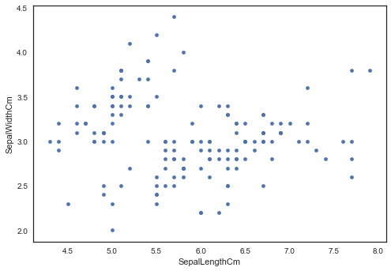  
```
Use the .plot extension from Pandas dataframes to plot things
Use this to make a scatterplot of the Iris features-petallengthcm on the x-axis and petalwidthcm on the y-axis.
iris.plot(kind="scatter", x="PetalLengthCm", y="PetalWidthCm")
```
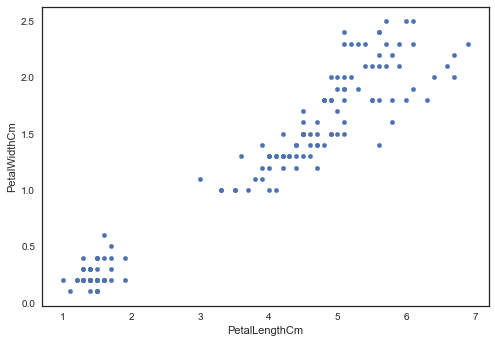
```
Use the seaborn library to make a similar plot
Seaborn jointplot shows two kinds of distribution in one visualization i.e. bivariate scatterplots and univariate histograms in the same figure
changed the size to 8 to make it bigger
sns.jointplot(x="SepalLengthCm", y="SepalWidthCm", data=iris, size=8)
```
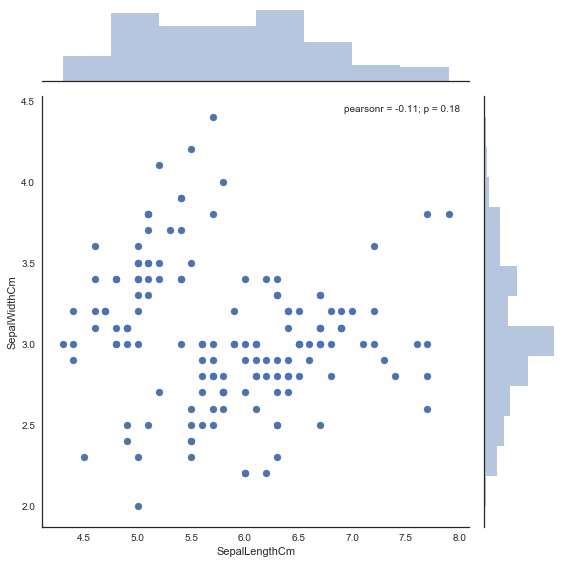
```
using the petallegth and petalwidth features
Use the seaborn library to make a similar plot for the petallength and petalwidth
Seaborn jointplot shows two kinds of distribution in one visualization
i.e. bivariate scatterplots and univariate histograms in the same figure
changed the size to 8 to make it bigger
sns.jointplot(x="PetalLengthCm", y="PetalWidthCm", data=iris, size=8)
```
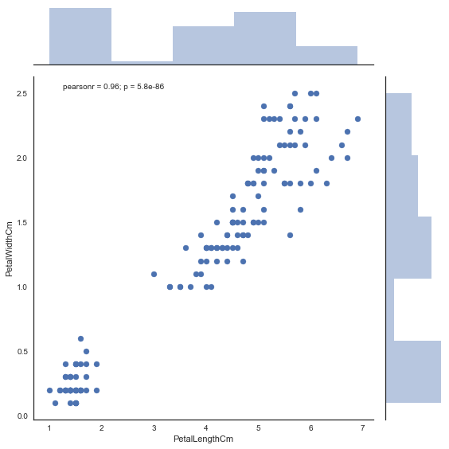
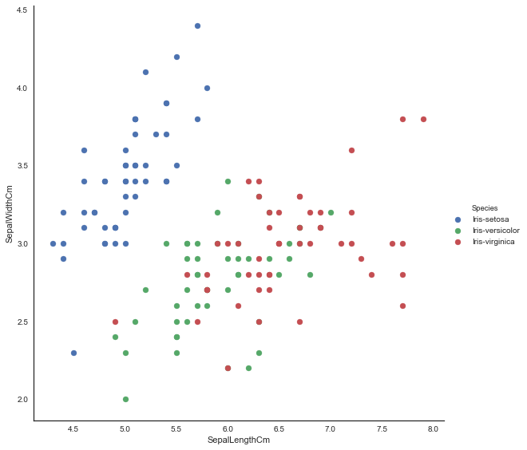
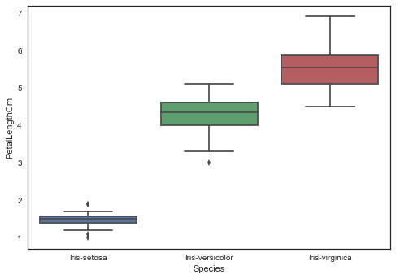

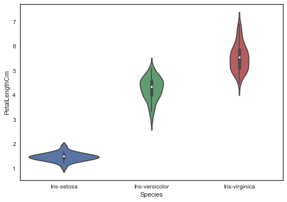
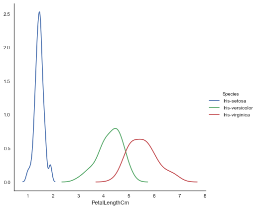
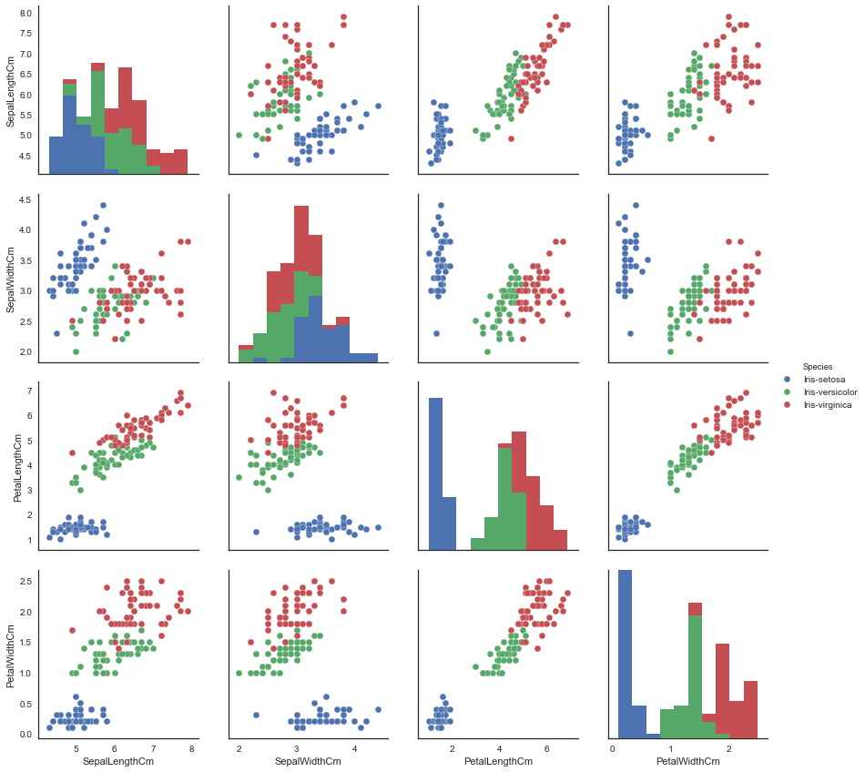
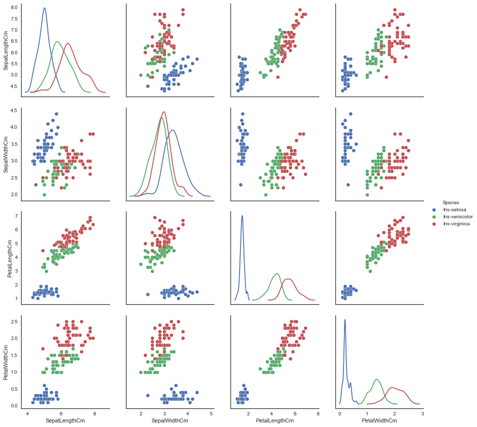

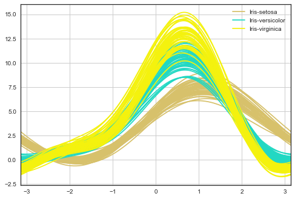
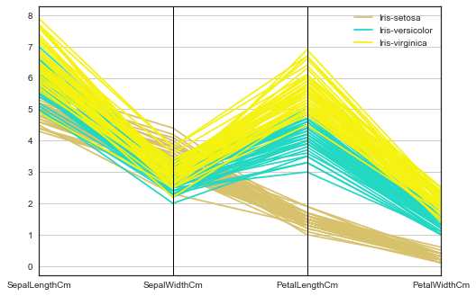
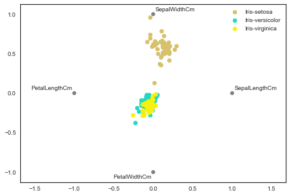


