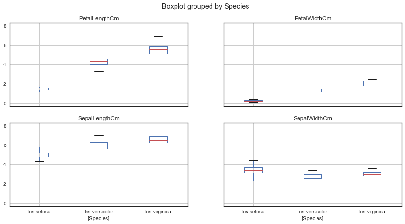

```python
#to enable visualizations 
%matplotlib inline

# First, import pandas, a useful data analysis tool especially when working with labeled data
import pandas as pd

# import seaborn, visualization library in python 
import warnings # current version of seaborn generates a bunch of warnings that we'll ignore
warnings.filterwarnings("ignore")
import seaborn as sns
import matplotlib.pyplot as plt
sns.set(style="white", color_codes=True)

# Next, we'll load the Iris flower dataset, which is in the specified directory below
iris = pd.read_csv("Iris.csv") # this makes the iris dataset a Pandas Dataframe

# Next, display the first few rows and columns of the iris dataframe, good way to see the colum headings for the dataset 
iris.head()
```


<div>
<style>
    .dataframe thead tr:only-child th {
        text-align: right;
    }

    .dataframe thead th {
        text-align: left;
    }

    .dataframe tbody tr th {
        vertical-align: top;
    }
</style>
<table border="1" class="dataframe">
  <thead>
    <tr style="text-align: right;">
      <th></th>
      <th>Id</th>
      <th>SepalLengthCm</th>
      <th>SepalWidthCm</th>
      <th>PetalLengthCm</th>
      <th>PetalWidthCm</th>
      <th>Species</th>
    </tr>
  </thead>
  <tbody>
    <tr>
      <th>0</th>
      <td>1</td>
      <td>5.1</td>
      <td>3.5</td>
      <td>1.4</td>
      <td>0.2</td>
      <td>Iris-setosa</td>
    </tr>
    <tr>
      <th>1</th>
      <td>2</td>
      <td>4.9</td>
      <td>3.0</td>
      <td>1.4</td>
      <td>0.2</td>
      <td>Iris-setosa</td>
    </tr>
    <tr>
      <th>2</th>
      <td>3</td>
      <td>4.7</td>
      <td>3.2</td>
      <td>1.3</td>
      <td>0.2</td>
      <td>Iris-setosa</td>
    </tr>
    <tr>
      <th>3</th>
      <td>4</td>
      <td>4.6</td>
      <td>3.1</td>
      <td>1.5</td>
      <td>0.2</td>
      <td>Iris-setosa</td>
    </tr>
    <tr>
      <th>4</th>
      <td>5</td>
      <td>5.0</td>
      <td>3.6</td>
      <td>1.4</td>
      <td>0.2</td>
      <td>Iris-setosa</td>
    </tr>
  </tbody>
</table>
</div>


```python
# to count the frequency of values for each species
iris["Species"].value_counts()
```


    Iris-virginica     50
    Iris-versicolor    50
    Iris-setosa        50
    Name: Species, dtype: int64


```python
# Use the .plot extension from Pandas dataframes to plot things
# Use this to make a scatterplot of the Iris features-sepallengthcm on the x-axis and sepalwidthcm on the y-axis.
iris.plot(kind="scatter", x="SepalLengthCm", y="SepalWidthCm")
```


    <matplotlib.axes._subplots.AxesSubplot at 0x25d5cbd2240>


```python
# Use the .plot extension from Pandas dataframes to plot things
# Use this to make a scatterplot of the Iris features-petallengthcm on the x-axis and petalwidthcm on the y-axis.
iris.plot(kind="scatter", x="PetalLengthCm", y="PetalWidthCm")
```


    <matplotlib.axes._subplots.AxesSubplot at 0x25d5e43aa20>


```python
# Use the seaborn library to make a similar plot
# Seaborn jointplot shows two kinds of distribution in one visualization i.e. bivariate scatterplots and univariate histograms in the same figure
# changed the size to 8 to make it bigger
sns.jointplot(x="SepalLengthCm", y="SepalWidthCm", data=iris, size=8)
```


    <seaborn.axisgrid.JointGrid at 0x25d5dac86d8>


```python
#using the petallegth and petalwidth features
# Use the seaborn library to make a similar plot for the petallength and petalwidth
# Seaborn jointplot shows two kinds of distribution in one visualization
# i.e. bivariate scatterplots and univariate histograms in the same figure
# changed the size to 8 to make it bigger
sns.jointplot(x="PetalLengthCm", y="PetalWidthCm", data=iris, size=8)
```


    <seaborn.axisgrid.JointGrid at 0x25d5e651cf8>


```python
# One piece of information missing in the plots above is what species each plant is
# We'll use seaborn's FacetGrid to color the scatterplot by species
# changed the size to 8
sns.FacetGrid(iris, hue="Species", size=8) \
   .map(plt.scatter, "SepalLengthCm", "SepalWidthCm") \
   .add_legend()
```


    <seaborn.axisgrid.FacetGrid at 0x25d5d6755c0>


```python
# We can look at an individual feature in Seaborn through a boxplot
# this shows the distribution of the petal length
sns.boxplot(x="Species", y="PetalLengthCm", data=iris)
```


    <matplotlib.axes._subplots.AxesSubplot at 0x25d58681240>


```python
# A good way to complement the boxplot is by using the Seaborn's striplot
# 
# Use jitter=True so that all the points are not represented(clustered) on the same axis,
#this allows the data to be properly represented
# 
# Saving the resulting axes as ax each time causes the resulting plot to be shown
# on top of the previous axes
# added size to make the change the size of the dots i.e. bigger or smaller
# changed edge color
ax = sns.boxplot(x="Species", y="PetalLengthCm", data=iris)
ax = sns.stripplot(x="Species", y="PetalLengthCm", data=iris, jitter=True, size = 6, edgecolor="black")

```


```python
# A violin plot combines the benefits of the previous two plots and simplifies them
# Violin plot, unlike box plots, depict the density of the data
# Denser regions of the data are fatter, and sparser thiner in a violin plot
# further showing the distributions of the features i.e. petallength
sns.violinplot(x="Species", y="PetalLengthCm", data=iris, size=8)
```


    <matplotlib.axes._subplots.AxesSubplot at 0x25d61d3ea20>


```python
# A final seaborn plot useful for looking at univariate relations is the kdeplot,
# which creates and visualizes a kernel density estimate of the underlying feature
#
sns.FacetGrid(iris, hue="Species", size=6) \
   .map(sns.kdeplot, "PetalLengthCm")\
   .add_legend()
```


    <seaborn.axisgrid.FacetGrid at 0x25d61cf1c18>


```python
# Use Pairplot to depictmpairwise relationship between the features in the Iris dataset
# 
# From the pairplot, we'll see that the Iris-setosa species is separataed from the other
# two across all feature combinations
sns.pairplot(iris.drop("Id", axis=1), hue="Species", size=3)
```


    <seaborn.axisgrid.PairGrid at 0x25d628ae128>


```python
# The diagonal elements in a pairplot show the histogram by default
# Use kde to update the diagonal subplots instead of histogram
# id is dropped 
sns.pairplot(iris.drop("Id", axis=1), hue="Species", size=3, diag_kind="kde")
```


    <seaborn.axisgrid.PairGrid at 0x25d65917b38>


```python
# This boxplot using pandas depicts the distribution by species and makes it more visually appealing
# changes to the figsize, alters the height and width of the plots
iris.drop("Id", axis=1).boxplot(by="Species", figsize=(14, 7))
```


    array([[<matplotlib.axes._subplots.AxesSubplot object at 0x0000025D60778B00>,
            <matplotlib.axes._subplots.AxesSubplot object at 0x0000025D605BE240>],
           [<matplotlib.axes._subplots.AxesSubplot object at 0x0000025D605CC630>,
            <matplotlib.axes._subplots.AxesSubplot object at 0x0000025D5FC1F5C0>]], dtype=object)





```python
# Import Andrews Curves 
# Andrews curves uses curves to depict data which involve using and plotting attributes of samples as coefficients for Fourier series
from pandas.tools.plotting import andrews_curves
andrews_curves(iris.drop("Id", axis=1), "Species")
```


    <matplotlib.axes._subplots.AxesSubplot at 0x25d62138550>


```python
# Parallel coordinates plots each feature on a separate column & then draws lines
# connecting the features for each data sample
from pandas.tools.plotting import parallel_coordinates
parallel_coordinates(iris.drop("Id", axis=1), "Species")
```


    <matplotlib.axes._subplots.AxesSubplot at 0x25d5ceebd68>


```python
# Which puts each feature as a point on a 2D plane, and then simulates
# having each sample attached to those points through a spring weighted
# by the relative value for that feature
from pandas.tools.plotting import radviz
radviz(iris.drop("Id", axis=1), "Species")
```


    <matplotlib.axes._subplots.AxesSubplot at 0x25d5d1d6ba8>


